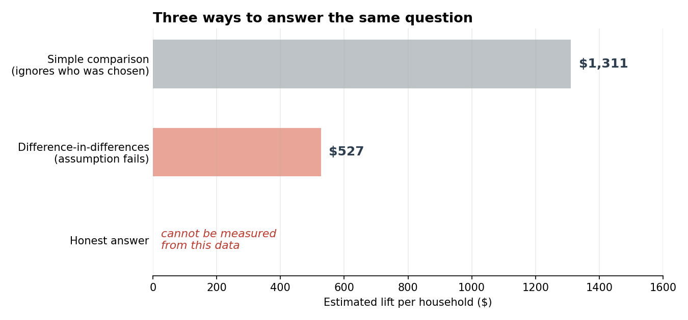
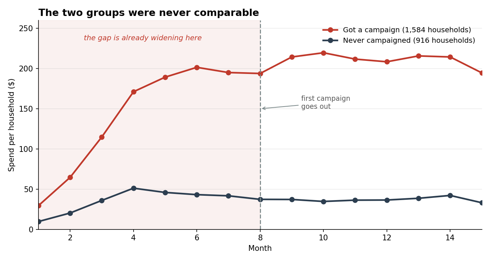
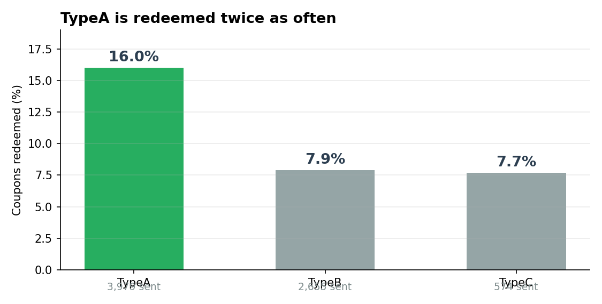

# Did the marketing campaigns work?

A grocery retailer ran 30 campaigns over two years. 1,584 households got at least one. 916 never got any.

Marketing wants to know what that spend bought them. A simple group comparison shows higher spending among contacted households, but it does not establish that the campaigns caused the difference.

2,500 households, 164,128 shopping trips, $4.68M in sales. SQL only, MySQL 8.

**Data:** [dunnhumby "The Complete Journey"](https://www.dunnhumby.com/source-files/) — real transaction records from a US grocery retailer, including which households received which campaigns and which coupons they redeemed.

---

## The easy answer

Compare what campaigned households spend against everyone else, over the period the campaigns ran:

| Group | Households | Avg spend |
|---|---|---|
| Got a campaign | 1,584 | **$1,590** |
| Never campaigned | 916 | **$279** |

The displayed rounded values give 5.70 times as much spending, or approximately 470% higher. This is a between-group comparison, not a measured increase caused by a campaign.



## Why it's wrong

The first campaign went out on day 224. That leaves 223 days at the start of the data where nobody had been contacted by anyone. So we can check what the two groups looked like *before* any campaign existed:

| Group | Avg spend before any campaign | Trips |
|---|---|---|
| Got a campaign | **$1,049** | 37.6 |
| Never campaigned | **$265** | 11.4 |

Campaigned households were already spending nearly four times as much, before a single campaign was sent.

The retailer picked its best customers and sent them the campaigns. That's a perfectly sensible thing for a retailer to do. It also means most of the gap in the first table was there already, and calling it a campaign result is simply wrong.

This is **selection bias**. It's the most expensive mistake in marketing measurement, because it always flatters the thing you're measuring, and it always argues for spending more.

## The proper method, and why it also fails here

If two groups start in different places, you compare how much each one *changed* rather than where each one ended up:

| Group | Before | After | Change |
|---|---|---|---|
| Got a campaign | $1,049 | $1,590 | **+$541** |
| Never campaigned | $265 | $279 | **+$14** |

Difference between the changes: **$527 per household**. That's difference-in-differences, it's the standard approach, and it lands at 40% of the naive figure. Sounds reasonable.

It rests on one assumption though: that without the campaigns, both groups would have carried on moving in step. You can't prove that, but you can check whether they were moving in step beforehand.

Monthly spend per household, ratio of treated to control:

| Month | Control | Treated | Ratio | |
|---|---|---|---|---|
| 1 | $9.7 | $29.5 | 3.05 | |
| 2 | $20.3 | $64.7 | 3.19 | |
| 3 | $35.9 | $114.9 | 3.20 | |
| 4 | $51.2 | $171.1 | 3.34 | |
| 5 | $45.9 | $189.3 | 4.13 | |
| 6 | $43.1 | $201.5 | 4.67 | |
| 7 | $41.7 | $195.0 | **4.68** | last month before any campaign |
| 8 | $37.3 | $193.8 | 5.20 | first campaign |



The red line pulls away from the black one well before the dashed line, which is where the first campaign went out. The gap was already widening — 3.05 to 4.68 — with no campaign anywhere near it. Control spending was falling while treated spending climbed.

There's no shared trend to compare against, so the $527 can't be trusted either.

---

## So what's the answer

**The comparisons implemented here do not support a causal campaign-lift estimate.** Selection bias and divergent pre-campaign trends limit their interpretation.

That's the finding. A number nobody has stress-tested is worse than no number, because someone will spend real money on it.

**What to do instead:** next campaign, hold back a random slice of the households you were going to contact. Randomly, not by value. Then the comparison works, because the two groups start the same by construction. Choose a holdout size using a power calculation, the minimum effect of interest and operational constraints.

---

## What can be measured

Redemption needs no comparison group — it only involves households that were actually sent something.

**27.4% of campaigned households redeemed at least one coupon.**

**TypeA campaigns are redeemed twice as often as the others:**

| Campaign type | Times sent | Times redeemed | Rate |
|---|---|---|---|
| TypeA | 3,979 | 635 | **16.0%** |
| TypeB | 2,655 | 210 | 7.9% |
| TypeC | 574 | 44 | 7.7% |



These are descriptive redemption rates. Differences in recipients, offers and campaign timing can affect comparisons between types; higher redemption does not establish greater incremental profit.

**Redemption rises with how many campaigns a household gets:**

| Campaigns received | Households | Redeemed anything |
|---|---|---|
| 1–2 | 492 | 9.3% |
| 3–4 | 383 | 24.8% |
| 5–6 | 317 | 30.0% |
| 7–10 | 326 | 48.8% |
| 11+ | 66 | 59.1% |

Read this one carefully. It does **not** show that sending more campaigns works. The retailer sent more campaigns to households it already favoured, so the same selection problem applies here as everywhere else. This does not rule out contact fatigue: selection effects and more opportunities to redeem can also explain the pattern.

**Higher income households redeem more,** which is not the usual expectation for coupons:

| Income | Households | Redeemed |
|---|---|---|
| $150–174K | 29 | 65.5% |
| $125–149K | 37 | 54.1% |
| $50–74K | 187 | 47.6% |
| $100–124K | 32 | 43.8% |
| $25–34K | 70 | 40.0% |

Only 801 of 2,500 households provided demographics, and the top bands here have fewer than 40 households each. It's a hint worth following up, not a conclusion.

---

## What I'd recommend

**Do not quote these comparisons as campaign lift.** They combine selection differences with any possible treatment effect.

**Add a holdout to the next campaign.** Randomise eligible households into treatment and control, with sample sizes based on statistical power and business constraints.

**Investigate TypeA before changing the mix.** Its observed redemption rate is higher, but recipient differences, offer costs and incremental outcomes need evaluation.

**Don't read the volume table as a reason to send more.** It's the same selection effect. The table cannot establish whether contact fatigue is present.

---

## What this analysis can't tell you

**Denominators need reconciliation.** Some SQL comparisons include only households active within each period, while the difference-in-differences calculation uses a broader household base. Reconcile those populations and reproduce the outputs before reusing the dollar estimates. A changing treated/control ratio alone is not a formal test of parallel trends in spending levels.

**No campaign cost data.** Redemption rates are here, spend is here, what any of it cost is not. Without that there's no return figure.

**Demographics cover a third of the base.** 801 of 2,500 households. Everything in the income and family-size tables describes those 801, and households that volunteer demographics may not be typical.

**Day numbers, not dates.** Time is anonymised as day 1 to 446, so seasonality can't be separated out. If campaigns clustered near holidays, that's mixed into everything here and nothing in this data can pull it apart.

**Redemption isn't the same as lift.** A redeemed coupon doesn't prove incremental spend — plenty of people redeem on something they'd have bought anyway. Redemption is a real measurement, but it answers a smaller question than the one that was asked.

---

## How to run it

Needs MySQL 8.0 or later.

**1. Build the tables.** Run section 0 of `campaign_analysis.sql`.

**2. Import the five CSVs** through the Workbench import wizard — right-click the table, Table Data Import Wizard, "use existing table".

Load `households`, `campaign_periods` and `campaigns_sent` before `coupon_redemptions` and `transactions`.

**3. Check the row counts** before going further:

```sql
SELECT 'transactions' AS t, COUNT(*) FROM transactions
UNION ALL SELECT 'campaigns_sent',     COUNT(*) FROM campaigns_sent
UNION ALL SELECT 'campaign_periods',   COUNT(*) FROM campaign_periods
UNION ALL SELECT 'coupon_redemptions', COUNT(*) FROM coupon_redemptions
UNION ALL SELECT 'households',         COUNT(*) FROM households;
```

Expect **164128, 7208, 30, 2318, 801**.

**4. Run sections 1 to 10.**

```
.
├── README.md
├── campaign_analysis.sql
├── charts/
│   ├── parallel_trends.png
│   ├── three_answers.png
│   └── redemption_by_type.png
└── data/
    ├── transactions.csv
    ├── campaigns_sent.csv
    ├── campaign_periods.csv
    ├── coupon_redemptions.csv
    └── households.csv
```

---

## About the data

dunnhumby's "The Complete Journey" — real transactions from a US grocery retailer covering 2,500 households over two years, with campaign and coupon records attached. Free for non-commercial use from [dunnhumby source files](https://www.dunnhumby.com/source-files/).

The original transaction file is 2.6M line items across 136MB. I've aggregated it to one row per shopping trip and cut it at day 446, which keeps everything this analysis needs and brings it down to 7MB so the repo stays clonable. Line-item and product detail are in the full source if you want them.

---

## Tech

MySQL 8.0 — CTEs, conditional aggregation, `LEFT JOIN` for group assignment, `FLOOR` for period bucketing, `UNION ALL`, `FIELD`, indexes.

Charts built in Python (pandas, matplotlib) from the same query outputs.
